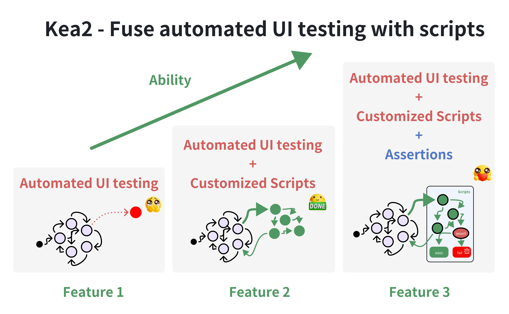
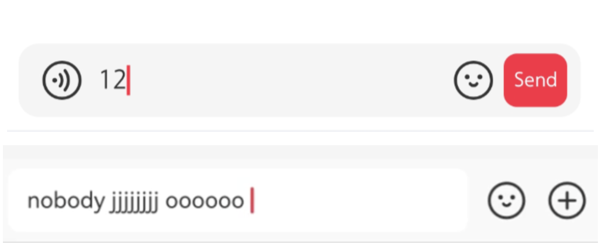

[](https://pypi.python.org/pypi/kea2-python)
[](https://pepy.tech/projects/kea2-python)

[](https://deepwiki.com/ecnusse/Kea2)

<div>
     
</div>

请联系梁锡贤，邮箱 [xixian@stu.ecnu.edu.cn](xixian@stu.ecnu.edu.cn)，并提供你的微信ID或二维码，以便邀请加入微信群讨论组。当然，我们也随时在GitHub上回答你的问题和反馈。

#### Github仓库 [https://github.com/ecnusse/Kea2](https://github.com/ecnusse/Kea2)  
#### Gitee镜像 [https://gitee.com/XixianLiang/Kea2](https://gitee.com/XixianLiang/Kea2)

### [点击此处：查看中文文档](README_cn.md) 

## 简介

<div align="center">
    
</div>
<div align="center">
    <a href="https://en.wikipedia.org/wiki/Kea">Kea2的logo：一只擅长发现“bugs”的大型鹦鹉</a>
</div>
</br>

Kea2是一个易用的移动应用模糊测试工具。其核心*创新点*是能够将自动化UI测试与脚本（通常由人工编写）融合，从而赋予自动化UI测试以人类智能，有效发现*崩溃错误*及*非崩溃功能（逻辑）错误*。

Kea2目前基于[Fastbot](https://github.com/ecnusse/Fastbot_Android) 3.0（原始[FastBot](https://github.com/bytedance/Fastbot_Android) 2.0的修改和增强版本），*一款来自字节跳动的工业级自动化UI测试工具*，以及[uiautomator2](https://github.com/openatx/uiautomator2)，*一款易用且稳定的Android自动化库*构建。  
Kea2目前支持[Android](https://en.wikipedia.org/wiki/Android_(operating_system))应用。

## 创新点及重要特性

<div align="center">
    <div style="max-width:80%; max-height:80%">
     
    </div>
</div>

- **特性 1**（查找稳定性问题）：集成了[Fastbot](https://github.com/bytedance/Fastbot_Android)的全部能力，用于压力测试和查找*稳定性问题*（即*崩溃错误*）；

- **特性 2**（自定义测试场景\事件序列\黑白名单\黑白控件[^1]）：运行Fastbot时可自定义测试场景（例如测试特定的App功能、执行特定的事件序列、进入指定UI页面、达到特定App状态、将指定Activity/UI控件/UI区域加入黑名单），并且在*python*脚本语言和[uiautomator2](https://github.com/openatx/uiautomator2)驱动的支持下，这些自定义功能具有高度可用性和灵活性；

- **特性 3**（支持断言机制[^2]）：在运行Fastbot时支持自动断言，来源于[Kea](https://github.com/ecnusse/Kea)的[基于性质的测试](https://en.wikipedia.org/wiki/Software_testing#Property_testing)理念，用于发现*逻辑错误*（即*非崩溃功能性错误*）。

对于**特性 2 和 3**，Kea2允许你专注于需要测试的App功能，而无需担心如何到达这些功能，只需让Fastbot帮你完成这些工作。这样你的脚本通常会编写得简短、稳健且容易维护，对应的App功能也能够得到更充分的压力测试！

**Kea2三大特性的能力对比**

|                                                  | **特性 1** | **特性 2** | **特性 3** |
| ------------------------------------------------ | ---------- | ---------- | ---------- |
| **发现崩溃错误**                                  | :+1:       | :+1:       | :+1:       |
| **发现深层状态中的崩溃错误**                      |            | :+1:       | :+1:       |
| **发现非崩溃功能（逻辑）错误**                    |            |            | :+1:       |

## Kea2的用户

Kea2（及其理念）已被以下项目使用/集成：

- [OPay Business](https://play.google.com/store/apps/details?id=team.opay.pay.merchant.service) — 一款金融与支付应用（每日200万用户）。OPay使用Kea2对POS机和移动设备进行回归测试。

- [微信iExplorer]() — 微信内部测试平台（配备交互式UI工具以简化脚本编写）

- [微信支付UAT]() — 微信支付内部测试平台（通过从系统规格合成性质，实现全自动基于性质的测试）

- [DevEco Testing](https://developer.huawei.com/consumer/cn/deveco-testing/) — 华为官方HarmonyOS测试平台（Kea2基于Hypium构建）

- [字节跳动Fastbot](https://github.com/bytedance/Fastbot_Android)

如果你也在使用Kea2，欢迎联系我们并反馈你的意见和问题。

## 设计与展望

Kea2当前工作流程：

- 使用[unittest](https://docs.python.org/3/library/unittest.html)作为测试框架管理脚本；
- 使用[uiautomator2](https://github.com/openatx/uiautomator2)作为UI测试驱动；
- 使用[Fastbot](https://github.com/bytedance/Fastbot_Android)作为后端自动化UI测试工具。

未来，Kea2计划支持：

- [pytest](https://docs.pytest.org/en/stable/)，另一款流行的python测试框架；
- [Appium](https://github.com/appium/appium)、[Hypium](https://developer.huawei.com/consumer/cn/doc/harmonyos-guides/hypium-python-guidelines)（针对HarmonyOS/Open Harmony）；
- 其他任何自动化UI测试工具（不限于Fastbot）

## 安装

运行环境：

- 支持Windows、MacOS和Linux
- python 3.8+，Android 5.0~16.0（已安装Android SDK）
- **关闭VPN**（特性 2 与 3 需要）

通过 `pip` 安装Kea2：

```bash
python3 -m pip install kea2-python
```

通过运行以下命令查看Kea2的选项：

```bash
kea2 -h
```

如果之前已安装Kea2，升级到最新版本：

```bash
python3 -m pip install -U kea2-python
```

> 如果你使用清华、科大等镜像站点，可能会升级失败，因为这些站点可能尚未同步最新版本。此时，你可以尝试手动指定最新版本安装，或直接使用官方PyPI源：`pip install kea2-python -i https://pypi.org/simple`。

升级到指定版本（例如1.0.0）：

```bash
python3 -m pip install -U kea2-python==1.0.0
```

在你偏好的工作目录初始化Kea2：

```python
kea2 init
```

> 如果是首次运行Kea2，此步骤必需。升级后也建议重新执行此步骤，以确保新配置生效。

## 快速测试

Kea2连接并运行于Android设备。建议先做快速测试以确保Kea2与你的设备兼容。

1. 连接一台真实Android设备或Android模拟器，并运行 `adb devices` 确保设备已被识别。

2. 运行 `quicktest.py`，测试示例应用 `omninotes`（在Kea2仓库中以 `omninotes.apk` 发布）。`quicktest.py`脚本会自动安装并短时间测试此示例应用。

运行快速测试：

```bash
python3 quicktest.py
```

> 快速测试会自动下载 `omninotes.apk`。如果下载失败，请从Kea2仓库根目录复制 `omninotes.apk` 到你的工作目录，再次执行快速测试命令。

若能看到应用 `omninotes` 成功运行并被测试，说明Kea2正常工作！  
否则请协助[提交错误报告](https://github.com/ecnusse/Kea2/issues)，并附上错误信息。谢谢！

## 特性 1（运行基础版Fastbot：查找稳定性错误）

利用Fastbot的全部能力对你的App进行压力测试，查找*稳定性错误*（即*崩溃错误*）；

```bash
kea2 run -p it.feio.android.omninotes.alpha --running-minutes 10 --throttle 200
```

如需了解各选项含义，请参见我们的[手册](docs/manual_en.md#launching-kea2)。

> 使用方式与原始Fastbot的[shell命令](https://github.com/bytedance/Fastbot_Android?tab=readme-ov-file#run-fastbot-with-shell-command)相似。

查看更多选项请使用：

```bash
kea2 run -h
```

## 特性 2（运行增强版Fastbot：自定义测试场景\事件序列\黑白控件）

在运行Fastbot等自动化UI测试工具测试你的App时，你可能会发现某些特定UI页面或功能难以到达或被覆盖，原因是Fastbot对你的App缺乏了解。令人欣慰的是，脚本测试擅长解决此类问题。特性 2 中，Kea2支持编写小脚本来指导Fastbot探索我们期望的任意页面，也能使用类似的小脚本在测试过程中屏蔽特定控件。

在Kea2中，一个脚本包含两部分：

- **前置条件(precondition)：** 指定何时执行脚本。
- **交互场景：** 脚本中各个测试方法指定的交互逻辑，用以到达预期位置。

### 简单示例

假设`Privacy`是一个在自动化UI测试中难以到达的页面，而Kea2可以轻松指导Fastbot进入此页面。

```python
    @prob(0.5)
    # precondition: 当处于页面 `Home`
    @precondition(lambda self: 
        self.d(text="Home").exists
    )
    def test_goToPrivacy(self):
        """
        通过打开`Drawer`，点击`Settings`选项，再点击`Privacy`来引导Fastbot进入`Privacy`页面。
        """
        self.d(description="Drawer").click()
        self.d(text="Settings").click()
        self.d(text="Privacy").click()
```

- 通过装饰器`@precondition`指定前置条件——当处于`Home`页面。  
此处`Home`页面是`Privacy`页面的入口，且Fastbot能轻松到达`Home`页面。脚本将在处于`Home`页面时被激活，这是借助于唯一控件`Home`是否存在来检测的。  
- 在脚本的测试方法`test_goToPrivacy`中，指定交互逻辑（打开`Drawer`，点击`Settings`，点击`Privacy`）来引导Fastbot进入`Privacy`页面。  
- 使用装饰器`@prob`指定概率（本例中为50%），当处于`Home`页面时有50%的概率进行引导，从而允许Fastbot仍有机会探索其它页面。

你可以在脚本文件`quicktest.py`中找到完整示例，使用命令 `kea2 run` 在Fastbot上执行此脚本：

```bash
# 启动Kea2并加载单个脚本 quicktest.py。
kea2 run -p it.feio.android.omninotes.alpha --running-minutes 10 --throttle 200 --driver-name d propertytest discover -p quicktest.py
```

## 特性 3（运行增强版Fastbot：加入自动断言）

Kea2支持在运行Fastbot时自动断言，用以发现*逻辑错误*（即*非崩溃错误*）。为此，你可以在脚本中添加断言。断言失败时，即发现了可能的功能性错误。

特性 3 的脚本包含三部分：

- **前置条件(precondition)：** 何时执行脚本。
- **交互场景：** 脚本测试方法中的交互逻辑。
- **断言(Assertion)：** 预期的App行为。

### 示例

在一个社交应用中，消息发送是常见功能。在消息发送页面，当输入框不为空（即有输入内容）时，`send`按钮应始终出现。

<div align="center">
    
</div>

<div align="center">
    预期行为（上图）和错误行为（下图）。
</div>
​    

针对上述一直应保持的性质，可编写以下脚本验证功能正确性：当消息发送页有`input_box`控件时，输入任意非空字符串后，断言`send_button`控件应始终存在。

```python
    @precondition(
        lambda self: self.d(description="input_box").exists
    )
    def test_input_box(self):

        # 生成一个随机非空字符串（这也是基于性质的测试，通过输入随机文本实现！）
        from hypothesis.strategies import text, ascii_letters
        random_str = text(alphabet=ascii_letters).example()

        # 将该非空字符串输入到输入框
        self.d(description="input_box").set_text(random_str)

        # 检查发送按钮是否存在
        assert self.d(description="send_button").exists

        # 我们甚至可以做更多断言，例如，
        #       输入字符串应成功显示在消息发送页面上
        assert self.d(text=random_str).exists
```

> 这里使用了[hypothesis](https://github.com/HypothesisWorks/hypothesis)生成随机文本。

你可以用类似特性 2 的命令行运行此示例。

## 特性 4（兼容已有脚本：通过前置脚本步骤到达特定层次）

Kea2支持复用已有的UI测试脚本。我们受到以下理念启发：*已有的UI测试脚本通常覆盖重要的App功能且能达到深层App状态，因此它们可以作为良好的“引导脚本”，驱动Fastbot探索重要且深层的App状态。*

例如，你可能已有“登录并添加好友”的UI测试脚本。此特性允许你使用已有脚本，在脚本中设置断点（即可中断点），并在每个断点后启动Fastbot探索App。这样你可以先完成登录，再启动Fastbot探索登录后的App状态，帮助Fastbot探索深层状态（Fastbot自身难以完成登录）。

### 示例

`hybridtest_examples`目录下有四个示例脚本，分别对应不同形式的用户脚本，展示如何在已有代码中启动kea2。

具体包括：

- [u2_unittest_example.py](hybridtest_examples\u2_unittest_example.py)：基于unittest组织的u2脚本。
- [u2_pytest_example.py](hybridtest_examples\u2_pytest_example.py)：基于pytest组织的u2脚本。
- [appium_unittest_example.py](hybridtest_examples\appium_unittest_example.py)：基于unittest组织的appium脚本。
- [appium_pytest_example.py](hybridtest_examples\appium_pytest_example.py)：基于pytest组织的appium脚本。

注意事项：

1. 你可以通过修改`if`条件控制是否执行你写的kea2相关代码，方便在同一脚本中启用或禁用kea2操作。这里以环境变量为例。
2. 由于kea2由u2驱动，若appium脚本想启动kea2，需先关闭appium会话。请确保`desired_caps`中配置了`"noReset": True`，避免关闭会话时重置应用。
3. 你需要在已有测试用例中插入以下代码模板：你可以在注释部分添加自己的hook逻辑，如启动或关闭appium会话、清理实例等，具体取决于你的setup和teardown设计。除此之外，只需配置`option`参数和`configs_path`参数（即`configs`目录所在路径，通常是执行`kea2 init`的目录），然后传入`run_kea2_testing`函数即可。

```python
from kea2 import Kea2Tester, Options, U2Driver

if os.environ.get('KEA2_HYBRID_MODE', '').lower() == 'true': 
    '''
    注意：这里的if条件可根据项目实际情况修改，环境变量形式仅为示例。    
    '''

    # 关闭你的驱动会话等
    # ...
    
    tester = Kea2Tester()
    result = self.tester.run_kea2_testing(
        Options(
            driverName="d",
            packageNames=[PACKAGE_NAME],
            propertytest_args=["discover", "-p", "Omninotes_Sample.py"],
            serial=DEVICE_SERIAL,
            running_mins=2,
            maxStep=20
        ),
        configs_path = None  # 默认，如果你的configs文件夹位于根目录，可省略此参数。           
    )
    
    # 重新启动驱动会话或清理实例
    # ...
    
    return  # 使得此测试用例后续步骤不执行
```

## 测试报告

Kea2会在每次测试结束后自动生成HTML格式的测试报告，报告位于你工作目录下的`output/`目录中。

你也可以通过命令 `kea2 report` 手动生成测试报告（详情见 `kea2 report -h`）。

此外，可以通过命令 `kea2 merge` 合并多次测试会话的报告（详情见 `kea2 merge -h`）。合并报告对于多次测试非常有用。

你可以查看Opay提供的[测试报告示例](https://ecnusse.github.io/Kea2_sample_report/)(感谢！)。更多关于测试报告的细节请参见[文档](docs/test_report_introduction.md)。

## 文档（更多文档）

### :blue_book: [用户手册](docs/manual_en.md)（重要！）

你可以查阅[用户手册](docs/manual_en.md)，其中包含：

- Kea2在微信上的使用示例（中文）；
- 如何定义Kea2脚本和使用装饰器（如`@precondition`、`@prob`、`@max_tries`）；
- 如何运行Kea2及命令行选项；
- 如何发现并理解Kea2的测试结果；
- 如何在模糊测试过程中将特定Activity、UI控件和UI区域加入[白名单或黑名单](docs/blacklisting.md)。

### 其他Kea2相关资源（中文）

- [Kea2和PBT技术的常见问题和回答](https://sy8pzmhmun.feishu.cn/wiki/SLGwwqgzIiEuC3kwmV8cSZY0nTg?from=from_copylink)  
- [Kea2 101（Kea2从0到1的入门教程与最佳实践，建议新手阅读）](https://sy8pzmhmun.feishu.cn/wiki/EwaWwPCitiUJoBkIgALcHtglnDK?from=from_copylink)  
- [Kea2分享交流会（2025.09，bilibili录播）](https://www.bilibili.com/video/BV1CZYNz9Ei5/)  
- [Kea2工具快速介绍（2025.11，bilibili录播）](https://www.bilibili.com/video/BV1WAyUBDEMw/)  

部分Kea/Kea2相关博客（中文）：

- [别再苦哈哈写测试脚本了，生成它们吧！(一)](https://mp.weixin.qq.com/s/R2kLCkXpDjpa8wCX4Eidtg)  
- [别再苦哈哈写测试脚本了，生成它们吧！(二)](https://mp.weixin.qq.com/s/s4WkdstNcKupu9OP8jeOXw)  
- [别再苦哈哈写测试脚本了，生成它们吧！(三)](https://mp.weixin.qq.com/s/BjXyo-xJRmPB_sCc4pmh8g)  
- [2025 Let’s GoSSIP 软件安全暑期学校预告第一弹——Kea2](https://mp.weixin.qq.com/s/8_0_GNNin8E5BqTbJU33wg)  
- [功能性质驱动的测试技术：下一代GUI自动化测试技术](https://appw8oh6ysg4044.xet.citv.cn/p/course/video/v_6882fa14e4b0694ca0ec0a1b) — 视频回放&PPT@MTSC 2025  

工业界对Kea2的理解和评价（点击箭头查看详情）：

<details>
  <summary>Kea2的性质是什么含义？Kea2意义和价值是什么？</summary>

    kea2其实是一个工具，它是python+u2+fastbot的集合体。它本身更像是一台装好了发动机和轮子的汽车底盘。
    
    性质是苏老师他们团队提出的一个概念，转换到测试领域的实际工作中，性质对应的是最小单位的功能（原子级功能），性质的依赖条件很少或没有，它可以自身运行。一个典型的性质就是登录，它仅仅具有输入用户名，输入密码，提交。再举个例子，给视频点个赞，也就是简单的两三步。就是一个性质。
    
    性质与kea2结合的意义在于解决过去使用appium过重的问题。用appium去测试一个性质通常要写很多行的代码，引导界面到达性质的位置。但使用kea2，就只需要编写性质，如何到其所在的位置是交给fastbot和它的学习算法来搞定的。 
    
    kea2另个重大的价值是，它解决了上述思想所需要的技术支撑，比appium更轻量的UI编写方式，fastbot编写性质的能力不足，以及无法编写逻辑和断言。整体上是保留了fastbot以往的优秀品质，完善了其不足和短板。
    
    简而言之，需要做传统的编排型的功能测试，仍然使用appium，使用kea2也行，但你感觉不到它的价值。本身有需要做混沌测试，模糊测试，兼容性测试。那么强烈，强烈推荐kea2。kea2更偏探索性测试而非编排型。
</details>

<details>
  <summary>kea2组成是什么？kea2的核心作用？kea2做了什么？</summary>

kea2组成：

    fastbot  --  fuzz测试引擎，负责跑路。
    u2 -- 负责进行业务空间的操作。与使用selenium，appium，没什么区别。
    python --  u2的操作，逻辑的编写，定制化的实现。

kea2的核心作用：

    提供了条件触发器。在FB跑路的时候，会不停遍历条件触发器，一旦触发，挂起FB，开始执行触发器指定的ui test及assert。执行完毕，继续切回FB跑路。

kea2做了什么：

    替换了FB的条件触发功能。
    替换了FB的黑名单，黑控件功能。
    替换了FB剪枝功能。
    增加了多元化的元素空间操作能力。
    增加了fuzz测试中的逻辑设定。
    增加了断言能力。
    增加了元素操作能力。
</details>

## Kea2使用的开源项目

- [Fastbot](https://github.com/bytedance/Fastbot_Android)
- [uiautomator2](https://github.com/openatx/uiautomator2)
- [hypothesis](https://github.com/HypothesisWorks/hypothesis)

## Kea2相关论文

> General and Practical Property-based Testing for Android Apps. ASE 2024. [pdf](https://dl.acm.org/doi/10.1145/3691620.3694986)

> An Empirical Study of Functional Bugs in Android Apps. ISSTA 2023. [pdf](https://dl.acm.org/doi/10.1145/3597926.3598138)

> Fastbot2: Reusable Automated Model-based GUI Testing for Android Enhanced by Reinforcement Learning. ASE 2022. [pdf](https://dl.acm.org/doi/10.1145/3551349.3559505)

> Guided, Stochastic Model-Based GUI Testing of Android Apps. ESEC/FSE 2017.  [pdf](https://dl.acm.org/doi/10.1145/3106237.3106298)

## 维护者/贡献者

Kea2由[ecnusse](https://github.com/ecnusse)团队积极开发与维护：

- [Xixian Liang](https://xixianliang.github.io/resume/) ([@XixianLiang][])
- [Bo Ma](https://github.com/majuzi123) ([@majuzi123][])
- [Chen Peng](https://github.com/Drifterpc) ([@Drifterpc][])
- [Ting Su](https://tingsu.github.io/) ([@tingsu][])

[@XixianLiang]: https://github.com/XixianLiang
[@majuzi123]: https://github.com/majuzi123
[@Drifterpc]: https://github.com/Drifterpc
[@tingsu]: https://github.com/tingsu

[Zhendong Su](https://people.inf.ethz.ch/suz/), [Yiheng Xiong](https://xyiheng.github.io/), [Xiangchen Shen](https://xiangchenshen.github.io/), [Mengqian Xu](https://mengqianx.github.io/), [Haiying Sun](https://faculty.ecnu.edu.cn/_s43/shy/main.psp), [Jingling Sun](https://jinglingsun.github.io/), [Jue Wang](https://cv.juewang.info/), [Geguang Pu]()也积极参与并对项目贡献良多！

Kea2还获得京东等多位工业界专家的宝贵建议和经验分享，感谢字节跳动（[Zhao Zhang](https://github.com/zhangzhao4444)、Fastbot团队的Yuhui Su）、OPay（Tiesong Liu）、微信（Haochuan Lu，Yuetang Deng）、华为、小米等多方支持，致敬！

### 成为贡献者！

Kea2是一个开源项目，欢迎更多贡献者加入！

详情请参见[开发者指南](DEVELOP.md)。

## Star历史

[](https://www.star-history.com/#ecnusse/Kea2&Date)

[^1]: 不少UI自动化测试工具提供了“自定义事件序列”能力（如[Fastbot](https://github.com/bytedance/Fastbot_Android/blob/main/handbook-cn.md#%E8%87%AA%E5%AE%9A%E4%B9%89%E4%BA%8B%E4%BB%B6%E5%BA%8F%E5%88%97) 和[AppCrawler](https://github.com/seveniruby/AppCrawler)），但在实际使用中存在不少问题，如自定义能力有限、使用不灵活等。此前不少Fastbot用户抱怨过其“自定义事件序列”在使用中的问题，如[#209](https://github.com/bytedance/Fastbot_Android/issues/209), [#225](https://github.com/bytedance/Fastbot_Android/issues/225), [#286](https://github.com/bytedance/Fastbot_Android/issues/286)等。

[^2]: 在UI自动化测试过程中支持自动断言是一个很重要的能力，但几乎没有测试工具提供这样的能力。我们注意到[AppCrawler](https://ceshiren.com/t/topic/15801/5)的开发者曾经希望提供一种断言机制，得到了用户的热切响应，不少用户从21年就开始催更，但始终未能实现。