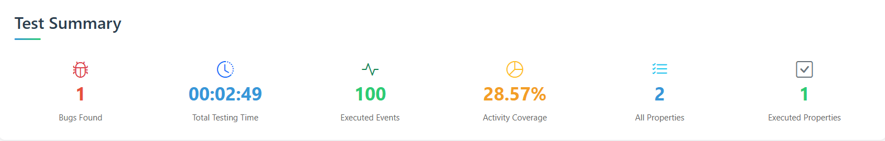
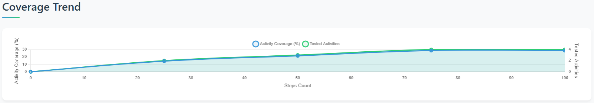
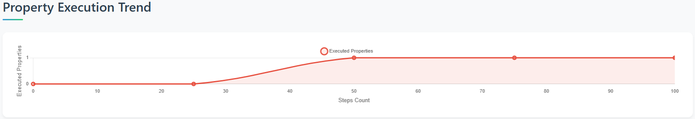
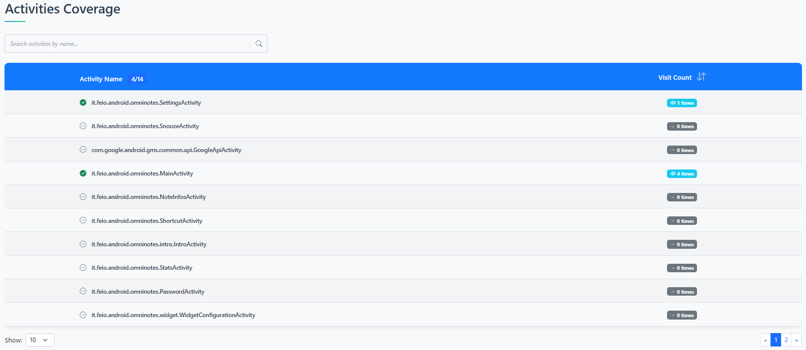
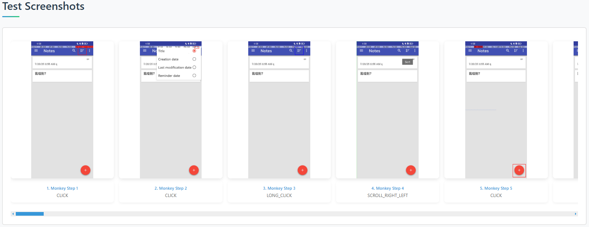
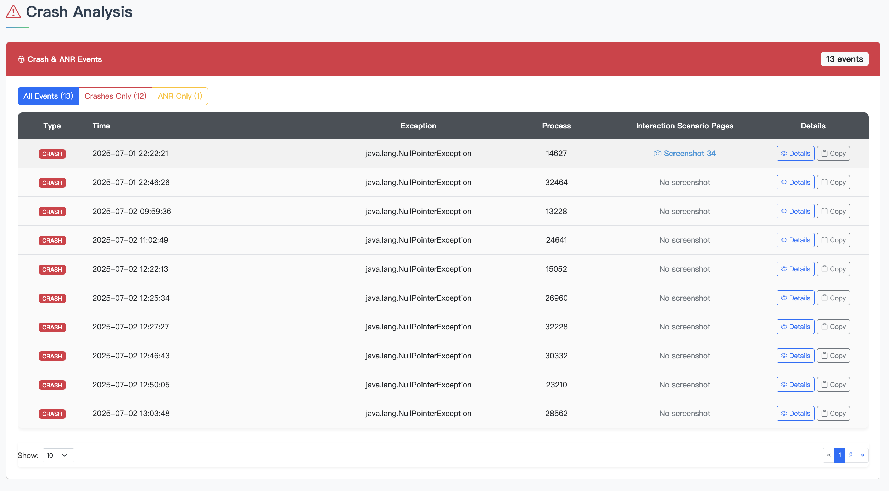
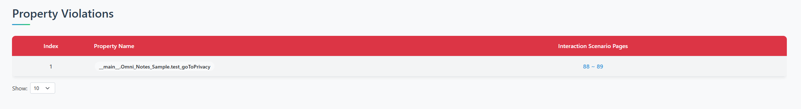
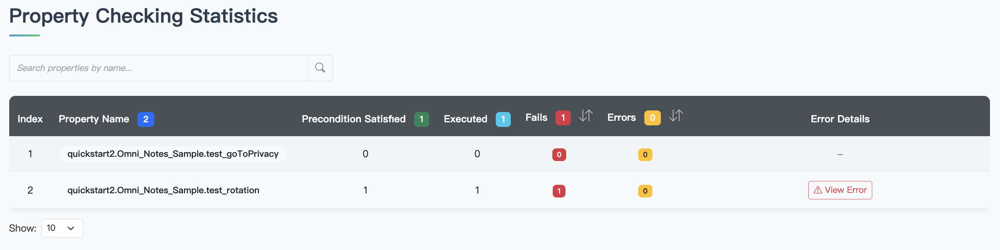
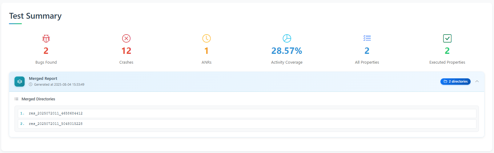
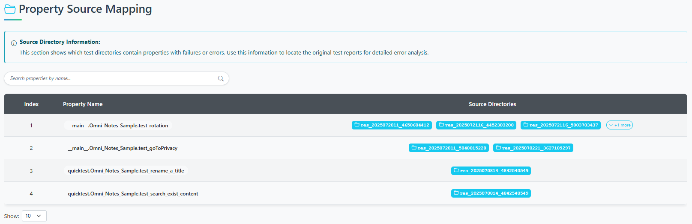

# Kea2 Test Report 使用文档

## 概述

Kea2 Test Report 是一个Android应用测试报告生成系统，能够生成详细且交互式的HTML测试报告。该报告分为单个测试报告和多个测试结果的合并报告，为开发者和测试人员提供全面的测试分析工具。

## 报告类型

### 1. 单个测试报告
用于展示单次测试运行的详细结果

### 2. 合并测试报告
用于展示多个测试运行结果的合并分析

---

## 单个测试报告详解

### 1. 页面头部 (Header)
**样式**：

**功能**：
- 显示报告标题和测试时间
- 统一的品牌标识

### 2. 测试摘要 (Test Summary)
**样式**：

**位置**：页面顶部的统计卡片区域

**包含指标**：
- 🐛 **Bugs Found**: 发现的bug数量
- ⏱️ **Total Testing Time**: 总测试时间
- 🎯 **Executed Events**: 执行的事件数量
- 📊 **Activity Coverage**: 活动覆盖率
- 📋 **All Properties**: 所有性质数量
- ✅ **Executed Properties**: 已执行性质数量

### 3. 覆盖率趋势图 (Coverage Trend)
**样式**：

**功能**：
- 显示测试过程中活动覆盖率的变化趋势
- 使用Chart.js绘制折线图
- 支持交互式数据点查看

### 4. 性质执行趋势图 (Property Execution Trend)
**样式**：

**功能**：
- 展示性质执行数量随时间的变化
- 帮助分析测试执行模式
- 识别测试性能瓶颈

### 5. 活动覆盖率 (Activities Coverage)
**样式**：

**功能**：
- 📋 显示应用中的所有活动及其遍历次数
- 🎯 区分已测试和未测试的活动
- 🔍 同样支持搜索和排序功能

### 6. 测试截图 (Test Screenshots)
**条件显示**：仅当 `take_screenshots` 为 true 时显示

**样式**：

**功能**：
- 📸 展示测试过程中的关键截图
- 🖼️ 支持图片预览和放大
- 📝 每张截图包含描述信息（事件类型、事件编号）

### 7. 崩溃分析 (Crash Analysis)
**样式**：

**包含内容**：

#### 7.1 崩溃事件 (Crash Events)
- 💥 详细的崩溃信息表格
- 📍 崩溃时间、类型、消息、对应截图
- 📋 可展开的堆栈跟踪信息

#### 7.2 ANR事件 (ANR Events)
- ⏰ Application Not Responding 事件
- 📊 ANR发生时间和详细信息
- 🔧 帮助诊断性能问题

### 8. 性质违反情况 (Property Violations)
**样式**：

**条件显示**：仅当有截图时显示

**功能**：
- 📋 列出所有性质违规情况
- 🖼️ 关联相关截图
- 🔗 可点击超链接查看具体违规内容（前置截图、交互截图、后置截图）

### 9. 性质检查统计 (Property Checking Statistics)
**样式**：

**核心功能**：

#### 9.1 搜索功能
- 🔍 按性质名称实时搜索
- 📊 显示搜索结果计数
- ❌ 一键清除搜索

#### 9.2 统计表格
**列信息**：
- **Index**: 序号
- **Property Name**: 性质名称（badge显示）
- **Precondition Satisfied**: 前置条件满足次数
- **Executed**: 执行次数
- **Fails**: 失败次数（可升序/降序排序）
- **Errors**: 错误次数（可升序/降序排序）
- **Error Details**: 详细Fail/Error信息

#### 9.3 错误详情展示
**单个错误**：
- 直接显示错误信息
- 包含堆栈跟踪

**多个错误**：
- 📊 错误摘要统计
- 🔽 可展开查看详细信息
- 🏷️ 错误类型标签分类
- 📈 错误发生次数统计

---

## 合并测试报告详解（仅介绍特有模块）

### PS：合并测试报告仅展示基础数据，具体错误信息以及截图信息请查看原始报告

### 1. 测试摘要 (Test Summary)
**增强功能**：
- 📊 **合并统计**: 汇总多个测试运行的数据
- 📁 **源目录信息**: 显示合并的测试目录数量
- 🔽 **可折叠设计**: 点击展开查看详细信息

**样式**：

#### 1.1 合并报告信息 (Merged Report Info)

**功能**：
- 📋 显示合并报告的基本信息
- 📁 显示合并的目录数量
- ⏰ 显示报告生成时间
- 🔽 可点击展开查看详细目录列表

#### 1.2 统计卡片 (Statistics Cards)

**合并数据展示**：
- 🐛 **Bugs Found**: 所有测试中发现的bug总数
- 💥 **Crashes**: 崩溃事件总数
- 📊 **ANRs**: ANR事件总数
- 📊 **Average Coverage**: 活动覆盖率
- 📋 **All Properties**: 所有性质数量
- ✅ **Executed Properties**: 已执行性质数量

### 2. 性质源映射 (Property Source Mapping) ⭐
**样式**：

**核心功能**：
- 🗺️ **源目录映射**: 显示哪些测试目录包含出现fail/error的性质
- 🔍 **快速定位**: 帮助用户找到原始测试报告
- 📋 **失败追踪**: 追踪性质失败的来源

