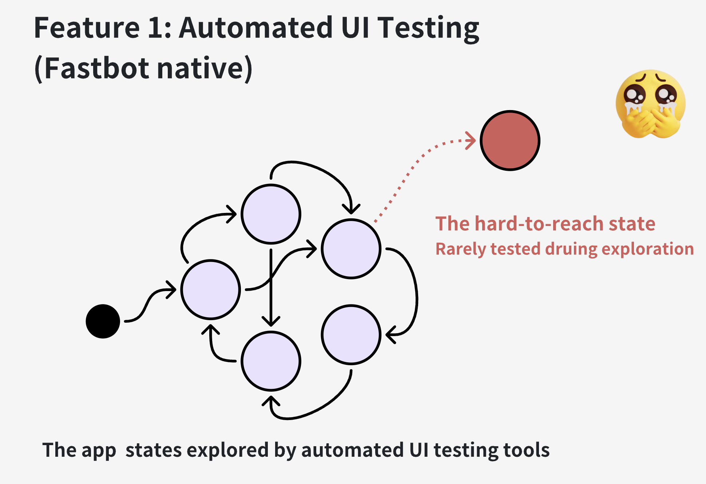
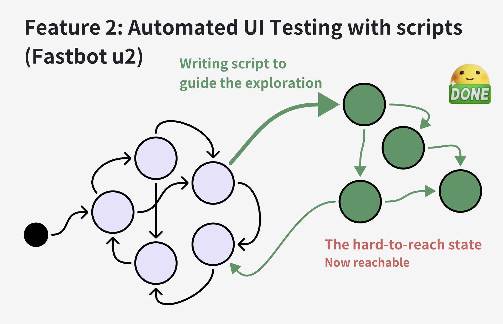
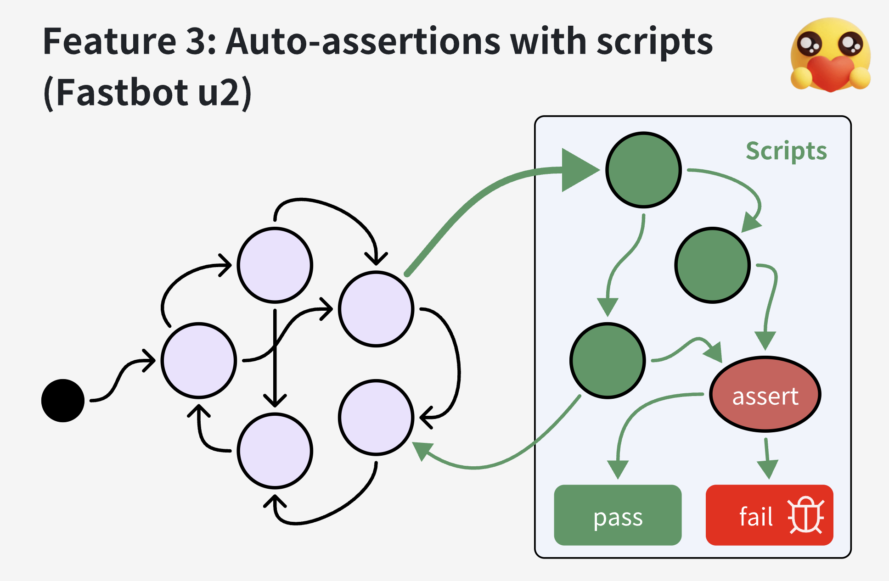

> Kea2 is designed to be capable of fusing the (property-based) *scripts* (e.g., written in uiautomator2) with automated UI testing tools (e.g., Fastbot), thus combining the strengths of human knowledge on app's business logics (empowered by the scripts) and random fuzzing. Many useful features (e.g., mimicing exploratory testing) can be implemented based on such a capability.


If you do not have an Android device at hand, you can use an Android emulator to run Kea2. The following commands can help create and start an Android emulator (Android version 12, API level 31) on a x86 machine (of course, you can create emulators by Android Studio):
```bash
sdkmanager "system-images;android-31;google_apis;x86_64"

avdmanager create avd --force --name Android12 --package 'system-images;android-31;google_apis;x86_64' --abi google_apis/x86_64 --sdcard 1024M --device 'Nexus 7'

emulator -avd Android12 -port 5554 &
```

> [quicktest.py](https://github.com/ecnusse/Kea2/blob/main/kea2/assets/quicktest.py) is a dead simple script which is ready-to-go with Fastbot. You can customize this script for testing your own apps.


<div align="center">
    <div>
     
    </div>
</div>

<div align="center">
     
</div>

Kea2 can support you to test your app by customizing testing scenarios (e.g., testing specific app functionalities, executing specific event traces, entering specifc UI pages, reaching specific app, blacklisting specific UI widgets) with the full capability and flexibility powered by `python` language and [uiautomator2](https://github.com/openatx/uiautomator2);


<div align="center">
     
</div>


